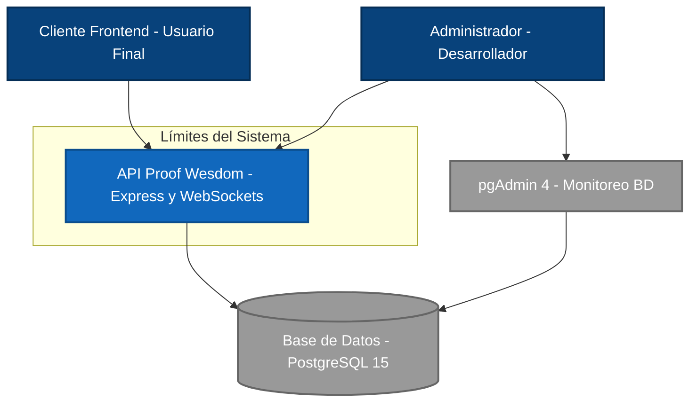
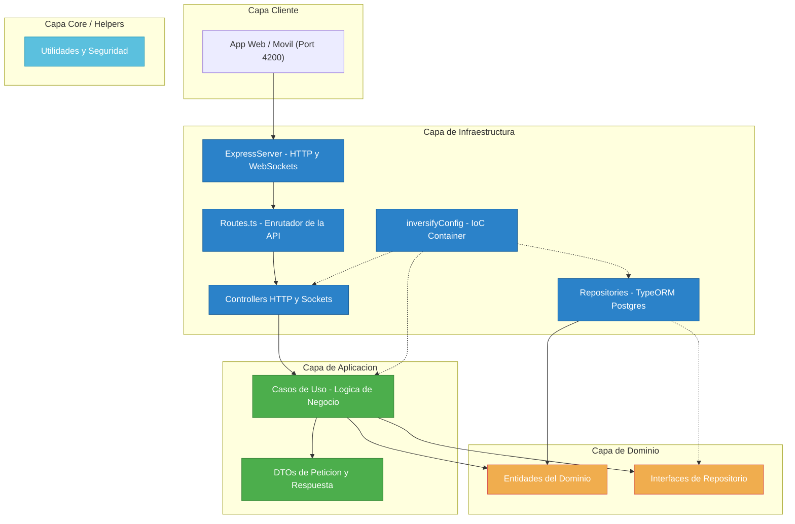

# Diagrama de Contexto - apiProofWesdom

Este documento presenta el **Diagrama de Contexto de Sistema (C4 Model - Nivel 1)** y el **Diagrama de Contenedores (C4 Model - Nivel 2)** para el proyecto **apiProofWesdom**, permitiendo visualizar los límites del sistema, sus actores principales, dependencias y la organización interna de su arquitectura de software.

---

## 1. Contexto del Sistema (Nivel 1)

El diagrama de contexto muestra cómo la API interactúa con usuarios, interfaces de usuario y servicios externos.

### Descripción de los Elementos

| Elemento | Tipo | Descripción |
| :--- | :--- | :--- |
| **Cliente Frontend** | Actor | Aplicación cliente (por ejemplo, web en Angular en puerto 4200 o móvil) que interactúa con la API para gestionar billeteras, ver el historial y realizar transacciones en tiempo real. |
| **Administrador / Desarrollador** | Actor | Personal técnico que administra la plataforma, monitorea la base de datos mediante pgAdmin y consulta/prueba la documentación interactiva a través de Swagger. |
| **API Proof Wesdom** | Sistema | El núcleo del backend. Expone servicios HTTP/REST y conexiones WebSocket para procesar la lógica de negocio, transacciones, autenticación y seguridad. |
| **Base de Datos (PostgreSQL)** | Sistema Externo | Motor de base de datos relacional que almacena las entidades persistidas (Usuarios, Roles, Wallets e Historial de transacciones). |
| **pgAdmin 4** | Sistema Externo | Interfaz web para la administración y visualización de la base de datos PostgreSQL. |

---

## 2. Diagrama de Contenedores y Arquitectura Limpia (Nivel 2)

El proyecto está diseñado bajo los principios de **DDD (Domain-Driven Design)** y **Arquitectura Limpia (Clean Architecture)**. Las dependencias se resuelven mediante el contenedor de Inversión de Control (IoC) de **InversifyJS**.

### Organización del Código por Capas

1. **Capa de Dominio (`src/domain`)**:
   - **Entidades (`entities/`)**: Modelan los conceptos fundamentales de negocio (ej. [UsersEntity.ts](file:///Users/softsaenz/Documents/pruebas/apiProofWesdom/src/domain/entities/UsersEntity.ts), [WalletEntity.ts](file:///Users/softsaenz/Documents/pruebas/apiProofWesdom/src/domain/entities/WalletEntity.ts)).
   - **Interfaces de Repositorio (`repositories/`)**: Contratos que aíslan el negocio de la tecnología de persistencia (ej. [IUserRepository.ts](file:///Users/softsaenz/Documents/pruebas/apiProofWesdom/src/domain/repositories/IUserRepository.ts)).
2. **Capa de Aplicación (`src/application`)**:
   - **Casos de Uso (`use-cases/`)**: Implementan el flujo de negocio y casos de uso específicos (ej. [WalletUseCase.ts](file:///Users/softsaenz/Documents/pruebas/apiProofWesdom/src/application/use-cases/WalletUseCase.ts)).
   - **DTOs (`dtos/`)**: Objetos planos para estructurar los datos entrantes y salientes de la API.
3. **Capa de Infraestructura (`src/infrastructure`)**:
   - **Servidor y Configuración (`config/`)**: Inicializa Express, carga certificados SSL y levanta el servidor (ej. [ExpressServer.ts](file:///Users/softsaenz/Documents/pruebas/apiProofWesdom/src/infrastructure/config/ExpressServer.ts)).
   - **Inversión de Control (`di/`)**: Módulo InversifyJS que asocia las interfaces de dominio con sus implementaciones de infraestructura (ej. [inversifyConfig.ts](file:///Users/softsaenz/Documents/pruebas/apiProofWesdom/src/infrastructure/di/inversifyConfig.ts)).
   - **Base de Datos (`database/`)**: Data Source y migraciones de TypeORM.
   - **Controladores y Rutas (`https/`)**: Manejadores HTTP y Sockets que reciben las llamadas de red y devuelven respuestas formateadas.
4. **Capa Core/Shared (`src/core`, `src/shared`)**:
   - Funciones utilitarias transversales de encriptación (RSA/AES), hashing de contraseñas (Argon2) y formateadores.
